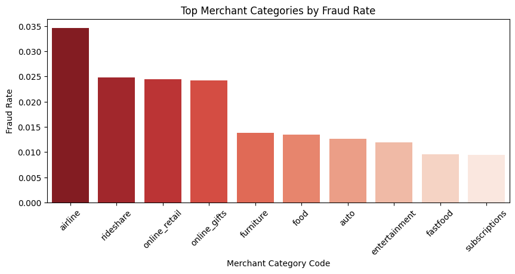

# 🧠 Exploratory Data Analysis (EDA) Report

This report summarizes the exploratory data analysis (EDA) conducted on a credit card transaction dataset for fraud detection. The dataset spans over 786,000 transactions collected over six months.

---

## 📦 Dataset Overview

| Metric         | Value                 |
|----------------|-----------------------|
| Total Records  | 786,363               |
| Fraudulent Txns| 12,417                |
| Fraud Rate     | **1.58%**             |
| Date Range     | 2016-01-01 to 2016-12-30 |
| Features       | 24                    |

---

## 1. 🎯 Class Distribution

A severe class imbalance exists with only 1.58% of the transactions labeled as fraud.

 

---

## 2. ⏰ Time-Based Behavior

### Hourly Transaction Distribution

Fraud and non-fraud transactions are distributed across all hours, but the fraud class is barely visible due to imbalance.

### Hourly Fraud Rate

Fraud is slightly more common around midday, peaking at approximately 1.8% around 1 PM.

### Weekly Fraud Rate

Slight variation in fraud rates across days of the week, with **Friday** slightly higher and **Saturday** the lowest.

 

---

## 3. 💰 Transaction Amount Patterns

### Overall Distribution

Transaction amounts are right-skewed, with most under $500. A log-scale histogram reveals the spread better.

### Fraud vs Non-Fraud Amounts

Fraudulent transactions generally involve higher amounts, peaking around $200–300, compared to non-fraud.

---

## 4. 🛍️ Merchant Category Risk

Top categories by fraud rate:

| Category        | Approx. Fraud Rate |
|-----------------|--------------------|
| `airline`       | ~3.5%              |
| `rideshare`     | ~2.5%              |
| `online_retail` | ~2.4%              |
| `online_gifts`  | ~2.3%              |

---

## 5. 🧮 Correlation Heatmap

Most numeric features have weak correlation with fraud, as expected. The highest is for `transactionAmount` (~+0.075). No signs of leakage.

---

## ✅ Summary

- Fraud tends to occur more around midday and involves higher-value transactions.
- Certain merchant categories are more susceptible.
- Raw numerical features offer limited direct predictive power, reinforcing the need for feature engineering.

---
