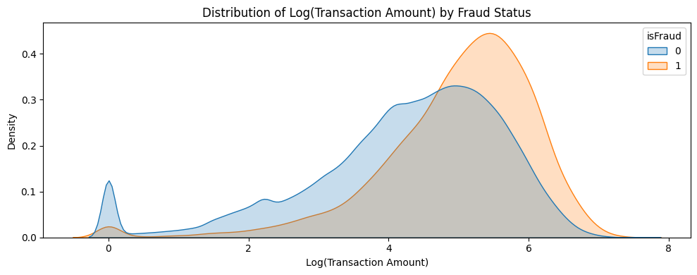
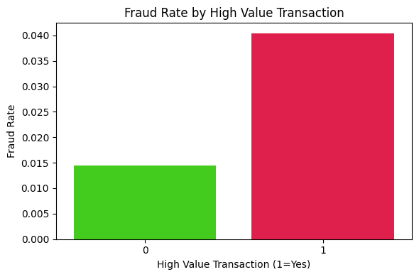
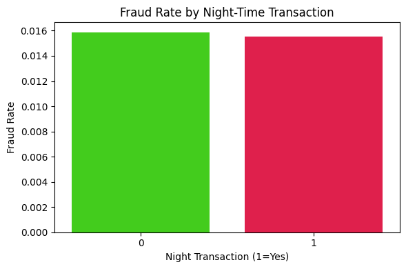
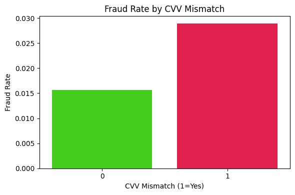
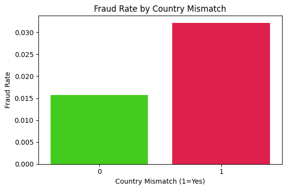
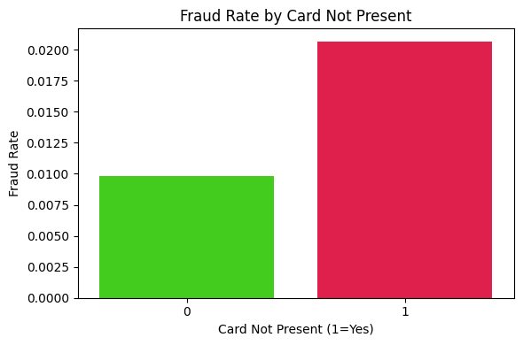
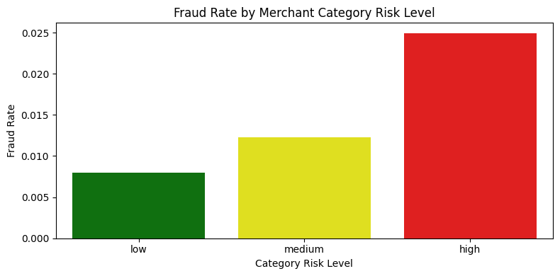
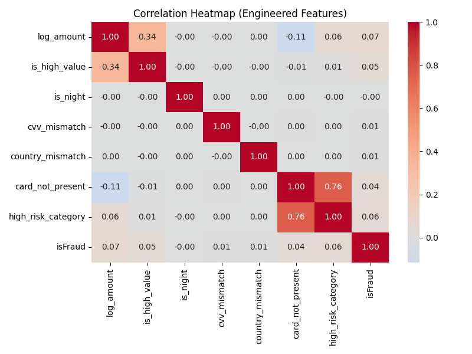

# 🛠️ Feature Engineering Report

This report outlines the key features created to enhance fraud detection accuracy and provide meaningful behavioral insights. Each engineered feature is based on hypotheses derived from the exploratory data analysis and domain intuition.

---

## 🔢 1. Log(Transaction Amount)

We applied a log transformation to the raw `transactionAmount` to normalize its highly right-skewed distribution and enhance signal detection for large-value anomalies.

- Fraudulent transactions tend to occur at higher values.
- Log scale provides a clearer distribution comparison between fraud and non-fraud.

---

## 💸 2. High-Value Transaction Flag (`is_high_value`)

A binary feature identifying transactions in the top 5% of value. These are often indicative of high-risk events.

- Fraud rate for high-value transactions exceeds **4%**, compared to **~1.4%** for others.

---

## 🌙 3. Night-Time Transaction (`is_night`)

Transactions that occur between **12 AM and 6 AM** are flagged, based on fraud patterns observed during off-business hours.

- Slight elevation in night-time fraud rate, though not significantly higher than daytime.

---

## 🔐 4. CVV Mismatch (`cvv_mismatch`)

Binary flag indicating whether the entered CVV differs from the card’s actual CVV — a common sign of unauthorized use.

  

- Mismatched CVVs are nearly **2×** more likely to be fraudulent.

---

## 🌍 5. Country Mismatch (`country_mismatch`)

This feature flags transactions where the acquiring bank country and the merchant country don’t match.

 

- Mismatched countries yield a fraud rate of **~3.2%**, double the normal.

---

## 💳 6. Card Not Present (`card_not_present`)

Flag indicating that the card was not physically used (e.g., online or card-not-present transactions).

- Fraud rate for card-not-present transactions is **over twice** that of in-person transactions.

---

## 🏷️ 7. Category Risk Level (`category_risk_level`)

Each `merchantCategoryCode` was classified into `low`, `medium`, or `high` risk groups based on fraud rate analysis during EDA.

- Clear gradient: `high` risk categories have fraud rates **3× higher** than `low`.

---
## 🔗 8. Correlation Heatmap (Engineered Features)

This heatmap helps assess the relationships between our newly engineered features and the target variable `isFraud`.
 

### 🧠 Key Takeaways:

- `log_amount` and `is_high_value` are moderately correlated (0.34) — expected, since high-value is based on amount thresholds.
- `card_not_present` and `high_risk_category` show strong correlation (0.76) — many high-risk categories involve online merchants.
- All features show **low direct correlation with `isFraud`** (as expected in real-world fraud data).
- No multicollinearity above critical thresholds, but we'll monitor model importance later.

This confirms our features are complementary and worth keeping for model training.

---

## ✅ Summary

The engineered features capture essential risk signals and behavioral patterns:

| Feature               | Type     | Risk Indicator                       |
|-----------------------|----------|--------------------------------------|
| `log_amount`          | Numeric  | Skew-adjusted purchase signal        |
| `is_high_value`       | Binary   | Rare, expensive transactions         |
| `is_night`            | Binary   | Suspicious hours                     |
| `cvv_mismatch`        | Binary   | Data entry inconsistency             |
| `country_mismatch`    | Binary   | Cross-border anomaly                 |
| `card_not_present`    | Binary   | Online/invisible fraud risks         |
| `category_risk_level` | Categorical | Business-type risk classification |

These features will be fed into our model training pipeline to improve performance and interpretability.

---

📘 *Notebook Reference:* [`notebooks/feature.ipynb`](../notebooks/feature.ipynb)  
📂 *Image Folder:* `images/img11.png` to `img18.png`
